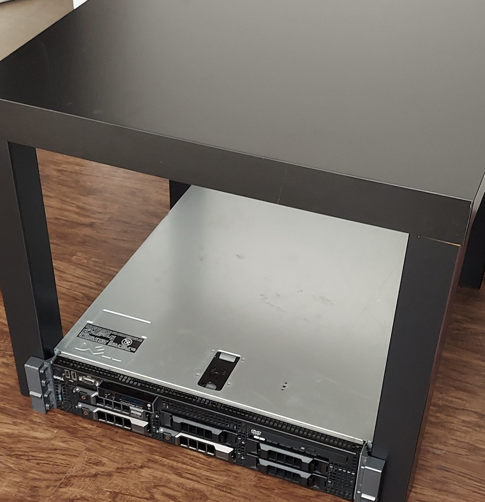

# Homelab :sparkles:

This is a living document of my homelab which I use to safely learn and gain hands on experience with new technologies.

> **What is a homelab?**
>
> Homelab is a laboratory at home where you can self-host, experiment with new technologies, practice for certifications, and so on.
> For more information about homelab in general, see the [r/homelab introduction](https://www.reddit.com/r/homelab/wiki/introduction).

## Hardware

> Depicted is a server rack constructed from an IKEA side table, plywood, casters, and love. For more information, see the [lackrack guide](https://wiki.eth0.nl/index.php/LackRack).

### Dell Poweredge R710

- **CPU**: Dual Intel Xeon 5600s
- **RAM**: 64 GB DDR3 ECC
- **Storage**: 12 TB HDD & 2 TB SSD

### Asus AX5400 Dual Band WiFi 6 Gaming Router

- **Ports**: 4
- **Speed**: 1000 Mbps

## Tech Stack

| Name | Description |
|-------------- | -------------- |
|  | Domain hosting, DNS, and remote access
|  | Containers
|  | Metric visualization
|  | Media player and library manager |
|  | DNS sinkhole and adblocking |
|  | Server operating system
|  | Reverse proxy

## Acknowledgements

- [Markdown Badges](https://github.com/Ileriayo/markdown-badges) - Badges
- [Khue's Homelab](https://github.com/khuedoan/homelab) - Inspiration
